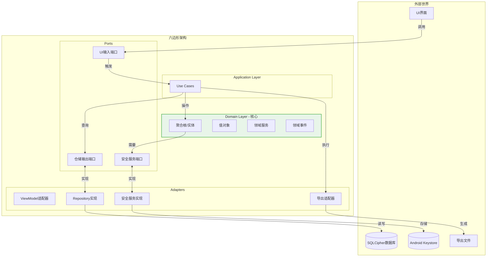
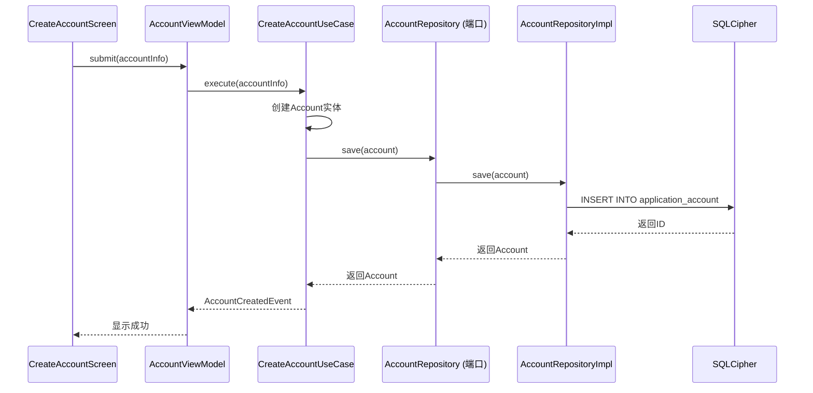
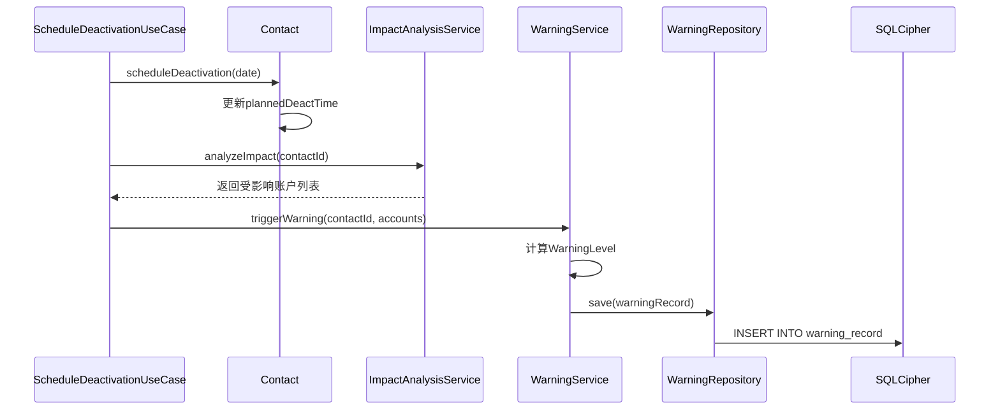

# Hermes - 架构设计文档

---

## 一、架构概述

### 1.1 架构风格

采用 **六边形架构（Hexagonal Architecture / Ports & Adapters）** 结合 **DDD 分层**，核心思想是：

| 原则 | 说明 |
|------|------|
| **核心独立** | 领域层不依赖外部技术，所有外部依赖通过接口（端口）接入 |
| **依赖倒置** | 高层模块不依赖低层模块，都依赖抽象 |
| **端口与适配器** | 通过端口定义交互契约，适配器实现具体技术 |

### 1.2 DDD 分层结构

| 层级 | 职责 | 依赖方向 |
|------|------|----------|
| **接口层** | 用户界面展示、API 接口 | 依赖应用层 |
| **应用层** | 用例编排、业务流程协调 | 依赖领域层 |
| **领域层** | 核心业务逻辑、领域模型 | 无外部依赖 |
| **基础设施层** | 数据持久化、外部服务集成 | 被领域层依赖 |

---

## 二、六边形架构图



---

## 三、模块结构

```
hermes/
├── interface/              # 接口层
│   ├── ui/                 # Compose组件、Activity
│   ├── viewmodel/          # ViewModel（适配器）
│   └── navigation/         # 导航管理
├── application/            # 应用层
│   └── usecase/            # Use Cases（用例编排）
├── domain/                 # 领域层（核心）
│   ├── entity/             # 聚合根：Account, Contact
│   ├── valueobject/        # 值对象：ContactType, AccountStatus
│   ├── repository/         # 仓储端口（接口）
│   ├── service/            # 领域服务：ImpactAnalysisService
│   └── event/              # 领域事件定义
└── infrastructure/         # 基础设施层
    ├── persistence/        # Room DAO、Repository实现
    ├── security/           # 密钥管理、加密服务
    └── file/               # 文件导入导出
```

---

## 四、各层职责与组件

### 4.1 接口层（Interface Layer）

| 组件 | 职责 | 说明 |
|------|------|------|
| **UI组件** | 用户界面展示 | Compose组件、Activity |
| **ViewModel** | UI状态管理 | 作为适配器，调用Use Cases |
| **Navigation** | 页面路由管理 | Jetpack Navigation |

### 4.2 应用层（Application Layer）

| 组件 | 职责 | 说明 |
|------|------|------|
| **Use Cases** | 业务流程编排 | 协调领域对象和仓储操作 |

**核心Use Cases**：
- `CreateAccountUseCase` - 创建账户
- `BindContactUseCase` - 绑定联系方式
- `ScheduleDeactivationUseCase` - 设置停用计划
- `GetWarningListUseCase` - 获取预警列表

### 4.3 领域层（Domain Layer）

| 组件 | 职责 | 说明 |
|------|------|------|
| **聚合根** | 业务实体与行为 | Account、Contact、Application、WarningRecord |
| **值对象** | 不可变数据 | ContactType、AccountStatus、ContactPurpose、WarningLevel |
| **仓储端口** | 数据访问接口 | AccountRepository、ContactRepository |
| **领域服务** | 跨聚合业务逻辑 | ImpactAnalysisService、WarningService |
| **领域事件** | 业务事件通知 | AccountCreated、ContactBound、WarningTriggered |

### 4.4 基础设施层（Infrastructure Layer）

| 组件 | 职责 | 说明 |
|------|------|------|
| **Repository实现** | 数据持久化 | Room DAO实现 |
| **安全服务** | 密钥管理与加密 | DEK+KEK信封加密、Android Keystore集成 |
| **文件服务** | 数据导入导出 | JSON/CSV格式处理 |

---

## 五、OpenSpec 规格映射

OpenSpec 规格定义的需求如何映射到架构各层：

| OpenSpec 需求 | 接口层 | 应用层 | 领域层 | 基础设施层 |
|--------------|--------|--------|--------|------------|
| 账号创建 | `AccountCreateScreen` | `CreateAccountUseCase` | `Account`实体 | `AccountRepository`实现 |
| 绑定联系方式 | `AccountDetailScreen` | `BindContactUseCase` | `ContactBinding`实体 | `ContactBindingRepository`实现 |
| 联系方式过期预警 | `WarningListScreen` | `GetWarningListUseCase` | `WarningRecord`实体、`WarningService` | `WarningRepository`实现 |
| 设置停用计划 | `ContactDetailScreen` | `ScheduleDeactivationUseCase` | `Contact.scheduleDeactivation()` | `ContactRepository`实现 |

---

## 六、数据流示例

### 6.1 创建账户流程



### 6.2 预警触发流程



---

## 七、安全架构

### 7.1 DEK+KEK 信封加密

```mermaid
flowchart TD
    subgraph 用户层
        PWD[用户密码]
    end
    
    subgraph 密钥管理层
        KEK[KEK (256位)]
        DEK[DEK (256位)]
        direction LR
        PWD -->|PBKDF2| KEK
        KEK -->|AES-256-GCM| DEK
    end
    
    subgraph 存储层
        KEYSTORE[(Android Keystore)]
        DB[(SQLCipher数据库)]
        KEK -->|存储| KEYSTORE
        DEK -->|加密后存储| DB
        DEK -->|SQLCipher| DB
    end
```

### 7.2 安全模块职责

| 组件 | 职责 |
|------|------|
| **KeyManager** | KEK/DEK生成、存储、获取 |
| **EncryptionService** | AES-256-GCM加密/解密 |
| **PasswordValidator** | 密码强度验证 |
| **BiometricAuthenticator** | 指纹/面容验证 |

---

## 八、技术选型

| 分类 | 技术 | 版本 | 理由 |
|------|------|------|------|
| **语言** | Kotlin | 1.9+ | 现代JVM语言 |
| **UI** | Jetpack Compose | 1.6+ | 声明式UI |
| **数据库** | SQLite + SQLCipher | 4.5+ | 数据库级加密 |
| **ORM** | Room | 2.6+ | SQLite封装 |
| **DI** | Hilt | 2.5+ | 依赖注入 |
| **导航** | Jetpack Navigation | 2.7+ | 标准化导航 |
| **密钥存储** | Android Keystore | - | 硬件级安全 |

---

*文档版本: v1.1*
*创建日期: 2026-05-11*
*最后更新: 2026-05-11*