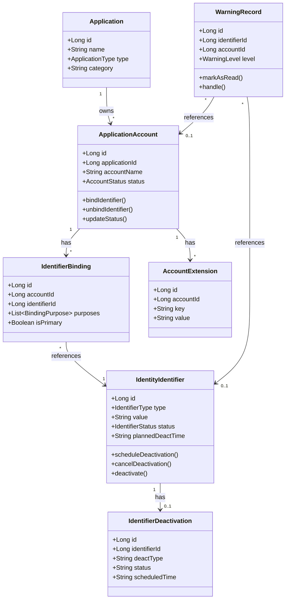

# Hermes - 领域模型

---

## 一、聚合根定义

### 1.1 ApplicationAccount（应用账户聚合根）

**身份标识**：用户在特定应用中注册的账户

**不变量（Invariants）**：
- 同一应用内，账户标识（accountIdentifier）必须唯一
- 每个账户至少绑定一个身份标识
- 同一账户的同一身份标识不能重复绑定

**属性**：
| 属性 | 类型 | 说明 |
|------|------|------|
| id | Long | 唯一标识 |
| applicationId | Long | 关联应用平台 |
| accountName | String | 账户名/昵称 |
| accountIdentifier | String | 应用内唯一标识（用户名） |
| status | AccountStatus | 账户状态 |
| keepAliveEnabled | Boolean | 是否支持长期在线 |
| bindings | List\<IdentifierBinding\> | 标识绑定列表 |
| extensions | List\<AccountExtension\> | 扩展属性列表 |

**行为**：
- `bindIdentifier(identifierId: Long, purposes: List\<BindingPurpose\>)` - 绑定身份标识
- `unbindIdentifier(identifierId: Long)` - 解绑身份标识
- `updateStatus(newStatus: AccountStatus)` - 更新账户状态
- `addExtension(key: String, value: String)` - 添加扩展属性

---

### 1.2 IdentityIdentifier（身份标识聚合根）

**身份标识**：用于声明身份的唯一标识（手机号/邮箱）

**不变量**：
- 同类型相同值的标识视为重复（唯一性约束）
- 计划停用时间必须大于当前时间

**属性**：
| 属性 | 类型 | 说明 |
|------|------|------|
| id | Long | 唯一标识 |
| type | IdentifierType | 标识类型（PHONE/EMAIL） |
| value | String | 标识值（明文） |
| status | IdentifierStatus | 标识状态 |
| plannedDeactTime | String | 计划停用时间 |
| deactReason | String | 停用原因 |

**行为**：
- `scheduleDeactivation(deactTime: String, reason: String)` - 设置停用计划
- `cancelDeactivation()` - 取消停用计划
- `deactivate()` - 执行停用

---

### 1.3 Application（应用聚合根）

**身份标识**：用户拥有账户的第三方网络服务

**属性**：
| 属性 | 类型 | 说明 |
|------|------|------|
| id | Long | 唯一标识 |
| name | String | 应用名称 |
| type | ApplicationType | 应用类型（WEB_SITE/MOBILE_APP/BOTH） |
| category | String | 分类（社交、金融、购物） |
| iconUrl | String | 图标地址 |

---

### 1.4 WarningRecord（预警聚合根）

**身份标识**：系统对潜在风险的提醒记录

**属性**：
| 属性 | 类型 | 说明 |
|------|------|------|
| id | Long | 唯一标识 |
| identifierId | Long? | 关联身份标识 |
| accountId | Long? | 关联账户 |
| warningType | WarningType | 预警类型 |
| warningLevel | WarningLevel | 预警级别 |
| message | String | 预警消息 |
| isRead | Boolean | 是否已读 |
| isHandled | Boolean | 是否已处理 |

**行为**：
- `markAsRead()` - 标记已读
- `handle()` - 标记已处理

---

## 二、值对象

### 2.1 IdentifierType（标识类型）

| 值 | 说明 |
|----|------|
| PHONE | 手机号 |
| EMAIL | 邮箱 |

### 2.2 IdentifierStatus（标识状态）

| 值 | 说明 |
|----|------|
| ACTIVE | 正常使用 |
| PENDING_DEACTIVATION | 待停用（已设置计划） |
| DEACTIVATED | 已停用 |
| INVALIDATED | 已失效（验证失败） |

### 2.3 AccountStatus（账户状态）

| 值 | 说明 |
|----|------|
| ACTIVE | 正常使用 |
| FROZEN | 冻结（因身份标识停用） |
| LOST | 丢失（无法找回） |
| ARCHIVED | 归档（隐藏显示） |

### 2.4 BindingPurpose（绑定用途）

| 值 | 说明 |
|----|------|
| LOGIN | 登录标识 |
| VERIFICATION | 安全验证 |
| RECOVERY | 找回密码 |
| NOTIFICATION | 接收通知 |
| SECONDARY_AUTH | 双因素认证 |

### 2.5 WarningLevel（预警级别）

| 值 | 说明 |
|----|------|
| HIGH | 高（紧急） |
| MEDIUM | 中（建议尽快处理） |
| LOW | 低（可稍后处理） |

### 2.6 CredentialType（凭据类型）- V2.0 规划

| 值 | 说明 | NIST 分类 |
|----|------|----------|
| PASSWORD | 密码 | Memorized Secret |
| TOKEN | 令牌（OTP/TOTP） | OTP Device |
| CERTIFICATE | 证书 | Cryptographic Device |

---

## 三、实体

### 3.1 IdentifierBinding（标识绑定实体）

**所属聚合**：ApplicationAccount

**不变量**：
- 同一账户同一身份标识只能绑定一次（唯一性约束）
- 用途列表不能为空

**属性**：
| 属性 | 类型 | 说明 |
|------|------|------|
| id | Long | 唯一标识 |
| accountId | Long | 关联账户 |
| identifierId | Long | 关联身份标识 |
| purposes | List\<BindingPurpose\> | 用途列表 |
| isPrimary | Boolean | 是否主要标识 |

### 3.2 AccountExtension（账户扩展实体）

**所属聚合**：ApplicationAccount

**不变量**：
- 同一账户内字段key必须唯一

**属性**：
| 属性 | 类型 | 说明 |
|------|------|------|
| id | Long | 唯一标识 |
| accountId | Long | 关联账户 |
| key | String | 字段标识 |
| value | String | 字段值 |
| label | String | 显示名称 |
| fieldType | String | 字段类型（STRING/DATE/BOOL/ENUM/INTEGER） |

### 3.3 IdentifierDeactivation（标识停用实体）

**所属聚合**：IdentityIdentifier

**属性**：
| 属性 | 类型 | 说明 |
|------|------|------|
| id | Long | 唯一标识 |
| identifierId | Long | 关联身份标识 |
| deactType | String | 停用类型（SCHEDULED/IMMEDIATE） |
| status | String | 状态（SCHEDULED/EXECUTED/CANCELLED） |
| scheduledTime | String | 计划停用时间 |

---

## 四、聚合关系图

---

## 五、领域服务

### 5.1 ImpactAnalysisService（影响分析服务）

**职责**：分析身份标识变更对账户的影响范围

**方法**：
- `analyzeImpact(identifierId: Long): List\<ApplicationAccount\>` - 获取受影响账户列表
- `calculateWarningLevel(affectedAccounts: List\<ApplicationAccount\>): WarningLevel` - 计算预警级别

### 5.2 WarningService（预警服务）

**职责**：管理预警的触发和处理

**方法**：
- `triggerWarning(identifierId: Long, accountId: Long?, message: String)` - 触发预警
- `clearWarnings(identifierId: Long)` - 清除身份标识相关预警

---

> 数据库表结构详见 [data-model.md](../data-model.md)

*文档版本：v2.0（NIST 标准术语）*
*创建日期：2026-05-11*
*最后更新：2026-05-12*